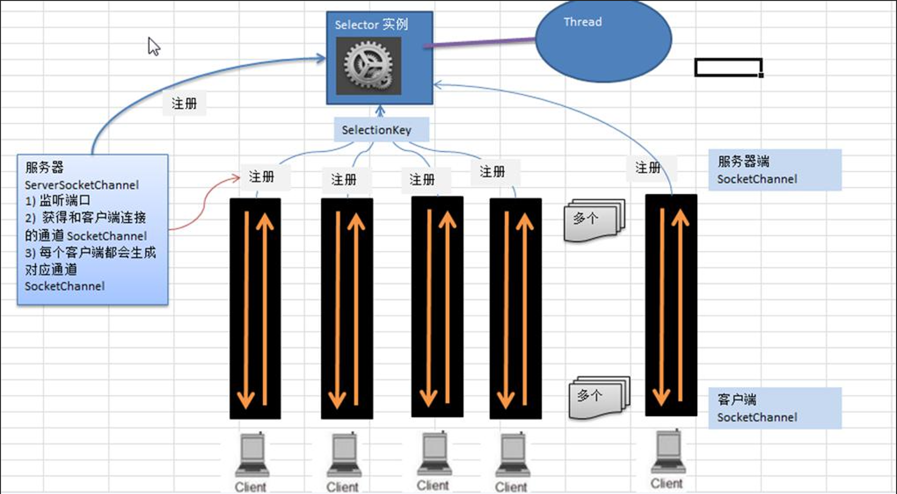
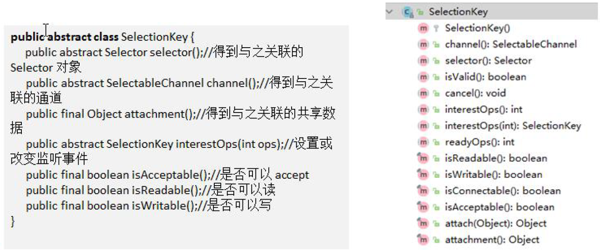
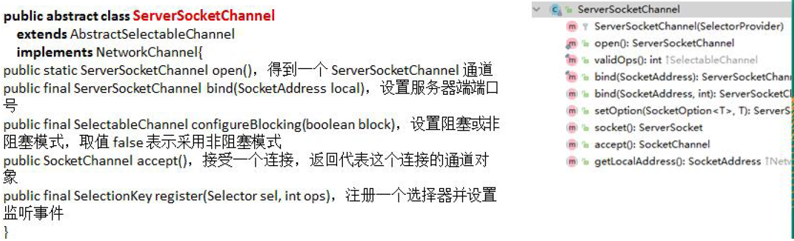
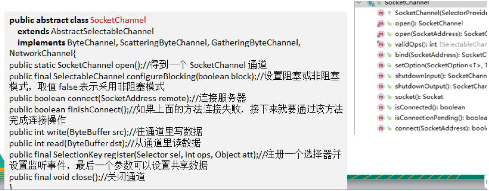
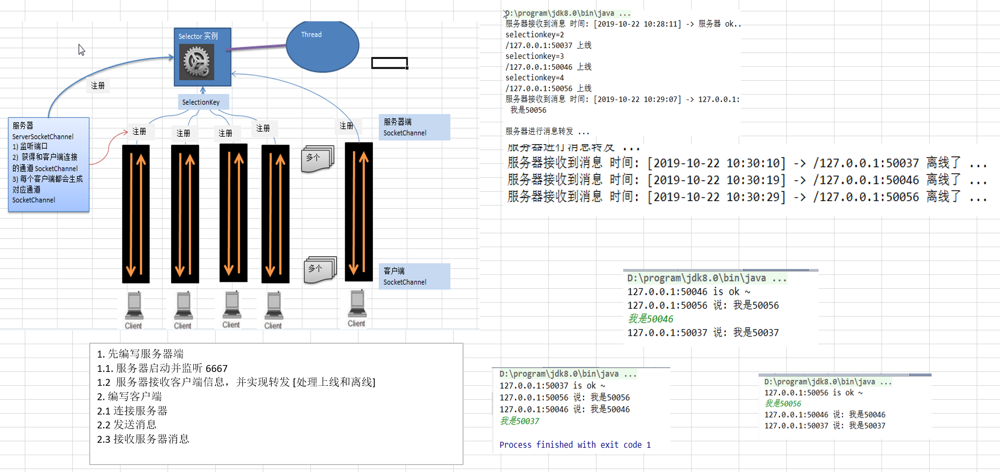

# 实验:NIO 网络编程应用实例-群聊系统

# NIO非阻塞网络编程原理分析



# SelectionKey
1) SelectionKey，表示Selector 和网络通道的注册关系, 共四种:
```aidl
int OP_ACCEPT：有新的网络连接可以accept，值为16
int OP_CONNECT：代表连接已经建立，值为8
int OP_READ：代表读操作，值为1
int OP_WRITE：代表写操作，值为4
源码中：
public static final int OP_READ = 1 << 0;
public static final int OP_WRITE = 1 << 2;
public static final int OP_CONNECT = 1 << 3;
public static final int OP_ACCEPT = 1 << 4;
```
2) SelectionKey的相关方法


# ServerSocketChannel
1) ServerSocketChannel 在服务器端监听新的客户端Socket 连接

2) 相关方法如下:


# SocketChannel
1) SocketChannel，网络IO 通道，具体负责进行读写操作。NIO 把缓冲区的数据写入通道，或者把通道里的数
据读到缓冲区。
2) 相关方法如下


# 群聊示意图

